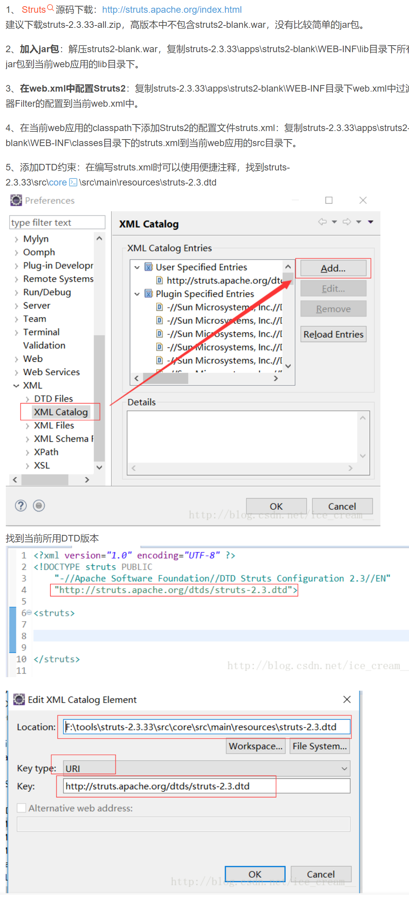

## Struts 项目环境配置指南

### 一、Tomcat 启动超时问题解决（代理配置）

#### 1. Eclipse 代理设置

**方式一：通过 Preferences 配置**

1. 打开 Eclipse，进入`Window -> Preferences -> General -> Network Connections`
2. 选择`Manual proxy configuration`，依次填入：
   - HTTP Proxy: 代理服务器地址
   - Port: 代理端口
3. 若需要认证，勾选`Enable proxy authentication`，填入用户名和密码
4. 点击`Apply and Close`保存

**方式二：通过 Run Configurations 配置 VM 参数**

1. 进入`Run -> Run Configurations`
2. 选择对应的 Tomcat 启动配置，切换到`Arguments`标签
3. 在`VM Arguments`中添加：
   ```
   -Dhttp.proxyHost=代理IP地址 -Dhttp.proxyPort=端口号
   -Dhttps.proxyHost=代理IP地址 -Dhttps.proxyPort=端口号
   ```
4. 点击`Apply`保存

#### 2. Tomcat 代理配置

**Windows 环境**

1. 编辑`Tomcat安装目录/bin/catalina.bat`
2. 在文件开头添加：
   ```bat
   set JAVA_OPTS=-Dhttp.proxyHost=代理IP -Dhttp.proxyPort=端口 -Dhttps.proxyHost=代理IP -Dhttps.proxyPort=端口
   ```

**Linux 环境**

1. 编辑`Tomcat安装目录/bin/catalina.sh`
2. 在文件开头添加：
   ```bash
   export JAVA_OPTS="-Dhttp.proxyHost=代理IP -Dhttp.proxyPort=端口 -Dhttps.proxyHost=代理IP -Dhttps.proxyPort=端口"
   ```

### 二、Struts DTD 文件无法下载问题解决

#### 1. 本地 DTD 文件配置

**方法一：修改 struts.xml 引用本地文件**

1. 从 Struts 的 JAR 包（如 struts-core-2.3.x.jar）中提取`struts-2.3.dtd`文件
2. 将文件保存到项目`WEB-INF/classes`目录下
3. 修改 struts.xml 头部声明：
   ```xml
   <!DOCTYPE struts PUBLIC
   "-//Apache Software Foundation//DTD Struts Configuration 2.3//EN"
   "WEB-INF/classes/struts-2.3.dtd">
   ```

**方法二：Eclipse XML Catalog 配置**

1. 打开`Window -> Preferences -> XML -> XML Catalog`
2. 点击`Add`按钮：
   - Location: 选择本地`struts-2.3.dtd`文件路径
   - Key Type: 选择`Public ID`
   - Key: 输入`-//Apache Software Foundation//DTD Struts Configuration 2.3//EN`
3. 点击`OK`完成配置

#### 2. 验证配置

1. 重启 Eclipse 和 Tomcat
2. 检查项目启动日志，确认无 DTD 相关错误
3. 验证 XML 文件编辑时是否有自动提示功能

### 三、补充建议

1. **JVM 内存优化**：若启动仍超时，可调整 Tomcat 的 JVM 参数：
   ```
   -Xms512m -Xmx1024m -XX:MaxMetaspaceSize=256m
   ```
2. **网络环境检查**：确认公司代理服务器地址、端口及认证信息是否正确
3. **文件完整性**：确保所有依赖的 JAR 包已正确导入项目
   

```bash

✦ 是的，需要在Eclipse和Tomcat中设置代理来解决网络访问问题。

  Eclipse代理设置：
   1. Window → Preferences → General → Network Connections
   2. 选择"Manual"代理配置
   3. 设置HTTP/HTTPS代理服务器和端口

  Tomcat代理设置：
  在catalina.bat或catalina.sh中添加：
   1 set JAVA_OPTS=%JAVA_OPTS% -Dhttp.proxyHost=代理地址 -Dhttp.proxyPort=端口
     -Dhttps.proxyHost=代理地址 -Dhttps.proxyPort=端口

  DTD文件问题：
  可以将struts-3.2.dtd文件下载到本地，然后在struts.xml中修改DTD引用为本地路径：
   1 <!DOCTYPE struts PUBLIC "-//Apache Software Foundation//DTD Struts Configuration 3.2//EN"
     "file:///本地路径/struts-3.2.dtd">

╭───────────────────────────────────────────────────────────────────────────────╮
│  > -Dhttp.proxyHost=代理地址 -Dhttp.proxyPort=端口需要询问公司网络安全部门吗  │
╰───────────────────────────────────────────────────────────────────────────────╯

✦ 是的，建议询问公司网络安全部门。他们可以提供：

   1. 正确的代理服务器地址和端口
   2. 认证信息（如果需要用户名密码）
   3. 允许的代理策略（哪些域名/端口可以通过代理）

  同时询问：
   - 是否需要配置-Dhttp.proxyUser和-Dhttp.proxyPassword
   - 是否有特殊的SSL证书需要导入
   - 代理是否支持HTTPS协议
```

```bash

 ╭────────────────────────────────────────────────────────────────────────────────────────────────────────────╮
 │ ✔ todo_write Updating todo list (5 pending, 0 in progress, 0 completed)                                   │
 │                                                                                                            │
 │    ⏺ Update Todos                                                                                         │
 │      ⎿ ☐ 联系公司网络安全部门获取代理信息                                                                  │
 │        ☐ 配置Eclipse代理设置                                                                               │
 │        ☐ 配置Tomcat代理设置                                                                                │
 │        ☐ 下载DTD文件到本地                                                                                 │
 │        ☐ 修改struts.xml中的DTD引用                                                                         │
 ╰────────────────────────────────────────────────────────────────────────────────────────────────────────────╯
✦ Windows系统详细步骤：

  1. 获取代理信息
  联系公司网络安全部门，获取：
   - HTTP代理服务器地址和端口
   - HTTPS代理服务器地址和端口
   - 代理用户名和密码（如果需要）

  2. 配置Eclipse代理
   1. 打开Eclipse
   2. Window → Preferences → General → Network Connections
   3. 选择"Manual"代理配置
   4. 填入代理信息：
      - HTTP代理服务器：地址和端口
      - HTTPS代理服务器：地址和端口
      - 如果需要认证，勾选"Requires Authentication"并输入用户名密码
   5. 点击"Apply"和"OK"

  3. 配置Tomcat代理
   1. 找到Tomcat安装目录（如：C:\apache-tomcat-9.0.54）
   2. 打开bin\catalina.bat文件（用记事本或编辑器）
   3. 在文件开头（@echo off下面）添加：
   1 set JAVA_OPTS=%JAVA_OPTS% -Dhttp.proxyHost=代理地址 -Dhttp.proxyPort=端口
     -Dhttps.proxyHost=代理地址 -Dhttps.proxyPort=端口
   2
   3 rem 如果需要认证
   4 set JAVA_OPTS=%JAVA_OPTS% -Dhttp.proxyUser=用户名 -Dhttp.proxyPassword=密码
   4. 保存文件

  4. 下载DTD文件到本地
   1. 用浏览器访问：http://struts.apache.org/dtds/struts-2.3.dtd
   2. 右键选择"另存为"
   3. 保存到项目目录，如：C:\workspace\your-project\src\main\resources\dtd\struts-2.3.dtd

  5. 修改struts.xml中的DTD引用
   1. 打开项目中的struts.xml文件
   2. 找到DTD声明行
   3. 修改为：
   1 <!-- 原来的引用 -->
   2 <!DOCTYPE struts PUBLIC "-//Apache Software Foundation//DTD Struts Configuration 2.3//EN"
     "http://struts.apache.org/dtds/struts-2.3.dtd">
   3
   4 <!-- 修改为本地引用 -->
   5 <!DOCTYPE struts PUBLIC "-//Apache Software Foundation//DTD Struts Configuration 2.3//EN"
     "file:///C:/workspace/your-project/src/main/resources/dtd/struts-2.3.dtd">

  6. 重启Tomcat验证
   1. 停止Tomcat：双击bin\shutdown.bat
   2. 清理Tomcat工作目录：删除work\Catalina文件夹下的所有内容
   3. 启动Tomcat：双击bin\startup.bat
   4. 观察启动日志，检查是否还有DTD下载错误

╭──────────────────────────────────────────────────────────────────────────────────────────────────────────╮
│ You are running iFlow CLI in your home directory. It is recommended to run in a project-specific         │
│ directory.                                                                                               │
╰──────────────────────────────────────────────────────────────────────────────────────────────────────────╯
```

```bash
╭────────────────────────────────────────────────────────────────────────────────────────────────────────────╮
 │ ✔ todo_write Updating todo list (5 pending, 0 in progress, 0 completed)                                   │
 │                                                                                                            │
 │    ⏺ Update Todos                                                                                         │
 │      ⎿ ☐ 联系公司网络安全部门获取代理信息                                                                  │
 │        ☐ 配置Eclipse代理设置                                                                               │
 │        ☐ 配置Tomcat代理设置                                                                                │
 │        ☐ 下载DTD文件到本地                                                                                 │
 │        ☐ 修改struts.xml中的DTD引用                                                                         │
 ╰────────────────────────────────────────────────────────────────────────────────────────────────────────────╯
✦ Windows系统详细步骤：

  1. 获取代理信息
  联系公司网络安全部门，获取：
   - HTTP代理服务器地址和端口
   - HTTPS代理服务器地址和端口
   - 代理用户名和密码（如果需要）

  2. 配置Eclipse代理
   1. 打开Eclipse
   2. Window → Preferences → General → Network Connections
   3. 选择"Manual"代理配置
   4. 填入代理信息：
      - HTTP代理服务器：地址和端口
      - HTTPS代理服务器：地址和端口
      - 如果需要认证，勾选"Requires Authentication"并输入用户名密码
   5. 点击"Apply"和"OK"

  3. 配置Tomcat代理
   1. 找到Tomcat安装目录（如：C:\apache-tomcat-9.0.54）
   2. 打开bin\catalina.bat文件（用记事本或编辑器）
   3. 在文件开头（@echo off下面）添加：
   1 set JAVA_OPTS=%JAVA_OPTS% -Dhttp.proxyHost=代理地址 -Dhttp.proxyPort=端口
     -Dhttps.proxyHost=代理地址 -Dhttps.proxyPort=端口
   2
   3 rem 如果需要认证
   4 set JAVA_OPTS=%JAVA_OPTS% -Dhttp.proxyUser=用户名 -Dhttp.proxyPassword=密码
   4. 保存文件

  4. 下载DTD文件到本地
   1. 用浏览器访问：http://struts.apache.org/dtds/struts-2.3.dtd
   2. 右键选择"另存为"
   3. 保存到项目目录，如：C:\workspace\your-project\src\main\resources\dtd\struts-2.3.dtd

  5. 修改struts.xml中的DTD引用
   1. 打开项目中的struts.xml文件
   2. 找到DTD声明行
   3. 修改为：
   1 <!-- 原来的引用 -->
   2 <!DOCTYPE struts PUBLIC "-//Apache Software Foundation//DTD Struts Configuration 2.3//EN"
     "http://struts.apache.org/dtds/struts-2.3.dtd">
   3
   4 <!-- 修改为本地引用 -->
   5 <!DOCTYPE struts PUBLIC "-//Apache Software Foundation//DTD Struts Configuration 2.3//EN"
     "file:///C:/workspace/your-project/src/main/resources/dtd/struts-2.3.dtd">

  6. 重启Tomcat验证
   1. 停止Tomcat：双击bin\shutdown.bat
   2. 清理Tomcat工作目录：删除work\Catalina文件夹下的所有内容
   3. 启动Tomcat：双击bin\startup.bat
   4. 观察启动日志，检查是否还有DTD下载错误

╭─────────────────────────────────────────────────────────────────────────────────────────────────────────────╮
│  > 为什么我旁边的程序员和我的设置完全一样，他为什么一切正常？而我却eclipse和tomcat启动超时失败。他并没有设  │
│    置代理。不过安全部门说他使用的线路和我不一样。                                                           │
╰─────────────────────────────────────────────────────────────────────────────────────────────────────────────╯

✦ 问题很可能是网络线路差异导致的。既然安全部门确认你们使用不同的线路，以下是可能的原因和解决方案：

  可能的原因：

   1. 网络策略差异：你的线路可能有更严格的防火墙规则或访问限制
   2. DNS解析问题：你的线路DNS可能无法正确解析外部域名
   3. 网络路由问题：你的线路到struts.apache.org的路由可能有问题
   4. 代理强制要求：你的线路可能强制要求使用代理才能访问外网

  解决方案：

  1. 测试网络连通性
  在命令行运行：
   1 ping struts.apache.org
   2 nslookup struts.apache.org
   3 telnet struts.apache.org 80

  2. 对比网络配置
   - 检查你的IP地址段和同事的IP地址段
   - 检查网络适配器设置（IP、DNS、网关）
   - 检查浏览器代理设置

  3. 尝试临时解决方案
  方法一：使用本地hosts文件
   1. 以管理员身份打开记事本
   2. 打开C:\Windows\System32\drivers\etc\hosts
   3. 添加：
   1 # 先获取struts.apache.org的IP地址
   2 xxx.xxx.xxx.xxx struts.apache.org

  方法二：完全离线方案
   1. 让同事把他的Tomcat工作目录中的DTD文件复制给你
   2. 或者从浏览器直接下载所有需要的DTD文件
   3. 全部使用本地文件引用

  4. 联系IT部门
  向IT部门说明：
   - 同事使用不同线路正常工作
   - 你的线路无法访问外部资源
   - 请求检查你的网络线路配置或更换线路

  这样可能比配置代理更直接有效。

╭───────────────────────────────────────────────────────────────────────────────────╮
│  > 但是我用浏览器却可以直接访问http://struts.apache.org/dtds/struts-2.3dtd并下载  │
╰───────────────────────────────────────────────────────────────────────────────────╯

✦ 这说明你的网络线路本身没有问题，问题出在Java/Eclipse/Tomcat的网络访问机制上。

  问题分析：

  浏览器能访问，但Java程序不能，常见原因：

  1. Java网络代理设置
  Java可能使用了不同的网络配置，而浏览器使用系统代理设置。

  2. 防火墙/杀毒软件
  某些防火墙会阻止Java进程访问网络，但允许浏览器。

  3. JVM网络参数
  JVM可能缺少必要的网络参数配置。

  解决方案：

  1. 检查Java网络设置
  在命令行运行：
   1 java -Dhttp.proxyHost=代理地址 -Dhttp.proxyPort=端口 -version

  2. 在Eclipse中直接配置JVM参数
   1. 右键项目 → Run As → Run Configurations
   2. 选择Tomcat配置
   3. 在"Arguments"标签页的"VM arguments"中添加：
   1 -Dhttp.proxyHost=代理地址 -Dhttp.proxyPort=端口 -Dhttps.proxyHost=代理地址 -Dhttps.proxyPort=端口

  3. 检查防火墙设置
   1. 打开Windows防火墙
   2. 检查是否有阻止Java(TM) Platform SE binary的规则
   3. 临时关闭防火墙测试

  4. 使用系统代理
  在catalina.bat中添加：
   1 set JAVA_OPTS=%JAVA_OPTS% -Djava.net.useSystemProxies=true

  5. 最简单的解决方案
  既然浏览器能下载，直接使用本地DTD文件引用，这是最可靠的方法。

╭──────────────────────────────────────────────────────────────────────────────────────────────────────────╮
│ You are running iFlow CLI in your home directory. It is recommended to run in a project-specific         │
│ directory.                                                                                               │
╰──────────────────────────────────────────────────────────────────────────────────────────────────────────╯

```
