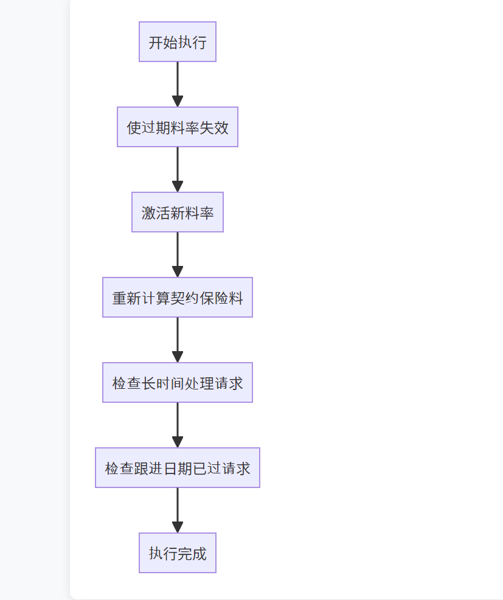
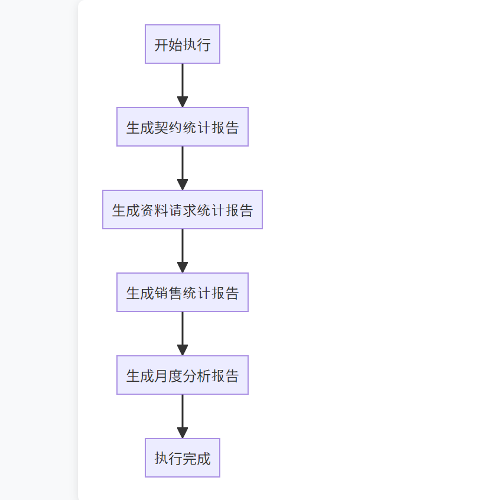

# 批处理执行流程详解

## 1. 概述

本系统包含三个主要的批处理任务，它们会在特定时间自动执行，用于维护系统数据和生成报告。同时，管理员也可以通过 Web 界面手动触发这些批处理任务。

### 1.1 批处理任务类型

1. **保险料更新批处理** - 更新保险料率和重新计算契约保险料
2. **契约状态更新批处理** - 更新契约状态和检查支付情况
3. **报告生成批处理** - 生成各种统计报告

## 2. 批处理启动机制

### 2.1 自动启动

系统启动时，`BatchStarter`类会自动启动所有批处理任务。

```java
// BatchStarter.java
@WebListener
public class BatchStarter implements ServletContextListener {
    @Override
    public void contextInitialized(ServletContextEvent sce) {
        // 应用启动时启动所有批处理
        PremiumUpdateBatch.startBatchProcessing();
        ContractStatusBatch.startBatchProcessing();
        ReportGenerationBatch.startBatchProcessing();
    }

    @Override
    public void contextDestroyed(ServletContextEvent sce) {
        // 应用关闭时停止所有批处理
        PremiumUpdateBatch.stopBatchProcessing();
        ContractStatusBatch.stopBatchProcessing();
        ReportGenerationBatch.stopBatchProcessing();
    }
}
```

### 2.2 手动执行

管理员可以通过 Web 界面手动执行批处理任务。

## 3. 保险料更新批处理 (PremiumUpdateBatch)

### 3.1 定时执行计划

- **主任务**：每天深夜 2 点执行
- **状态检查**：每小时 0 分执行

### 3.2 执行流程

```mermaid
graph TD
    A[开始执行] --> B[使过期料率失效]
    B --> C[激活新料率]
    C --> D[重新计算契约保险料]
    D --> E[检查长时间处理请求]
    E --> F[检查跟进日期已过请求]
    F --> G[执行完成]
```



### 3.3 详细处理步骤

1. **使过期料率失效**

   ```sql
   UPDATE premium_rates SET valid_to = CURDATE() - INTERVAL 1 DAY
   WHERE valid_to IS NOT NULL AND valid_to < CURDATE()
   ```

2. **激活新料率**

   ```sql
   UPDATE premium_rates SET valid_from = CURDATE()
   WHERE valid_from <= CURDATE() AND (valid_to IS NULL OR valid_to >= CURDATE())
   ```

3. **重新计算契约保险料**
   - 查询需要重新计算的契约
   - 调用存储过程重新计算保险料
   - 更新契约表中的保险料字段

## 4. 契约状态更新批处理 (ContractStatusBatch)

### 4.1 定时执行计划

- **主任务**：每天深夜 3 点执行
- **支付检查**：每小时 30 分执行

### 4.2 执行流程

```mermaid
graph TD
    A[开始执行] --> B[取消审查期限已过契约]
    B --> C[使支付期限已过契约失效]
    C --> D[完成到期契约]
    D --> E[检查支付延迟契约]
    E --> F[检查需要催促的支付]
    F --> G[执行完成]
```


### 4.3 详细处理步骤

1. **取消审查期限已过契约**

   ```sql
   UPDATE contracts SET contract_status = '取消'
   WHERE contract_status = '審査中' AND created_at < DATE_SUB(CURDATE(), INTERVAL 30 DAY)
   ```

2. **使支付期限已过契约失效**

   ```sql
   UPDATE contracts SET contract_status = '失効'
   WHERE contract_status = '承認' AND last_payment_date < DATE_SUB(CURDATE(), INTERVAL 60 DAY)
   ```

3. **完成到期契约**
   ```sql
   UPDATE contracts SET contract_status = '満期'
   WHERE contract_status = '承認' AND maturity_date <= CURDATE()
   ```

## 5. 报告生成批处理 (ReportGenerationBatch)

### 5.1 定时执行计划

- **周报**：每周周一深夜 4 点执行
- **月报**：每月 1 日深夜 5 点执行

### 5.2 执行流程

```mermaid
graph TD
    A[开始执行] --> B[生成契约统计报告]
    B --> C[生成资料请求统计报告]
    C --> D[生成销售统计报告]
    D --> E[生成月度分析报告]
    E --> F[执行完成]
```



### 5.3 报告类型

1. **契约统计报告** - 统计各种状态的契约数量
2. **资料请求统计报告** - 统计资料请求的处理情况
3. **销售统计报告** - 统计销售和支付情况
4. **月度分析报告** - 包含契约、销售和客户分析

## 6. 手动执行批处理

### 6.1 Web 界面操作

管理员可以通过以下路径访问批处理管理界面：

```
http://localhost:8080/admin/batch
```

### 6.2 界面功能

- 单独执行每个批处理任务
- 一次性执行所有批处理任务
- 查看批处理状态

### 6.3 手动执行代码示例

```java
// BatchControllerServlet.java
@WebServlet("/admin/batch")
public class BatchControllerServlet extends HttpServlet {
    protected void doPost(HttpServletRequest request, HttpServletResponse response) {
        String action = request.getParameter("action");

        switch (action) {
            case "premium_update":
                PremiumUpdateBatch.manualExecute();
                break;
            case "contract_status":
                ContractStatusBatch.manualExecute();
                break;
            case "report_generation":
                ReportGenerationBatch.manualExecute();
                break;
            case "all_batches":
                PremiumUpdateBatch.manualExecute();
                ContractStatusBatch.manualExecute();
                ReportGenerationBatch.manualExecute();
                break;
        }
    }
}
```

## 7. 批处理监控

### 7.1 日志记录

所有批处理的执行都会记录在系统日志中：

```
[2024-01-15 02:00:00] 保険料更新バッチを実行します
[2024-01-15 02:00:05] 無効化した料率: 2件
[2024-01-15 02:00:10] 有効化した料率: 5件
[2024-01-15 02:00:15] 更新した契約: 3件
[2024-01-15 02:00:16] 保険料更新バッチが正常に完了しました
```

### 7.2 错误处理

批处理执行过程中出现的异常会被捕获并记录：

```java
try {
    // 执行批处理逻辑
    executeBatchLogic();
} catch (Exception e) {
    System.err.println("[" + new Date() + "] バッチ処理中にエラーが発生しました: " + e.getMessage());
    e.printStackTrace();
}
```

## 8. 开发者注意事项

### 8.1 添加新的批处理任务

1. 创建新的批处理类，实现定时执行逻辑
2. 在 BatchStarter 中添加启动和停止代码
3. 在 BatchControllerServlet 中添加手动执行接口
4. 在 batch.jsp 中添加管理界面

### 8.2 修改执行时间

在各个批处理类中修改定时器的初始延迟和执行间隔：

```java
// 修改执行时间示例
scheduler.scheduleAtFixedRate(
    BatchClass::executeBatch,
    getInitialDelay(4), // 修改为4点执行
    24 * 60 * 60 * 1000, // 24小时执行一次
    TimeUnit.MILLISECONDS
);
```

### 8.3 调试批处理

1. 使用 manualExecute()方法手动执行进行测试
2. 查看控制台输出和日志文件
3. 检查数据库中的数据变化
