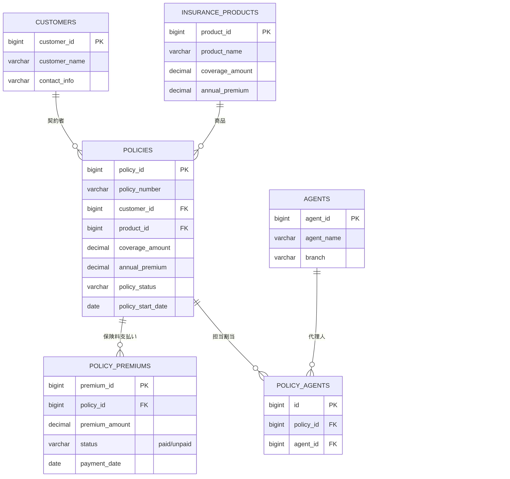

# 保険契約情報結合クエリ 001 (复杂的多表关联查询)

该 SQL 查询的核心目的是生成一份“有效保单综合信息报表”，业务逻辑上用于快速掌握当前有效保单的关键信息，支持业务监控、客户服务或销售分析。以下是具体解读：

### 一、查询目的：整合有效保单的核心信息

从业务视角看，这份查询主要解决**“当前有效的保单有哪些？它们的关键信息是什么？”** 的问题，具体包括：

```
保单基本信息（ID、编号、状态、生效日期）
客户信息（投保人姓名）
产品信息（产品名称、保额、年保费）
销售渠道（代理人姓名，若有）
财务状态（已缴保费总额）
```

### 二、业务逻辑与结果解读

#### 1. 核心筛选条件：聚焦“有效保单”

```sql
WHERE p.policy_status = 'active' -- 仅保留状态为“有效的”保单
ORDER BY p.policy_start_date DESC -- 最新生效的保单排在最前
```

业务意义：排除已失效、取消或过期的保单，确保数据聚焦当前在保业务，便于业务人员跟进活跃客户。

#### 2. 表连接逻辑：关联核心业务实体

```
连接方式 关联表 业务逻辑必要性
INNER JOIN 客户表（customers） 必关联：每张有效保单必须对应真实客户
INNER JOIN 产品表（insurance_products） 必关联：每张保单必须对应具体保险产品
LEFT JOIN 代理人关联表+代理人表 可选关联：部分保单可能无代理人（如客户直接购买）
```

#### 3. 关键指标：已缴保费总额（子查询）

```sql
(SELECT COALESCE(SUM(pp.premium_amount), 0)
FROM policy_premiums pp
WHERE pp.policy_id = p.policy_id AND pp.status = 'paid'
) AS total_paid_premiums
```

业务价值：实时展示客户的缴费情况，帮助判断保单财务状态（如是否欠费、是否已缴清）。

### 三、典型业务场景应用

```
客服日常跟进：快速查询客户的保单详情（如产品名称、保额、已缴保费），提升服务效率。
销售业绩分析：通过代理人姓名关联，统计不同代理人的有效保单数量及保费规模。
财务监控：监控有效保单的保费收入情况，为现金流分析提供数据支持。
风险排查: 识别保额异常或保费未缴足的保单，进行风险预警。
```

### 四、结果样例与解读要点

```sql

| policy_id | 保单号（policy_number） | 投保人（policyholder_name） | 产品名称（product_name） | 保额（coverage_amount） | 年保费（annual_premium） | 保单状态（policy_status） | 代理人（agent_name） | 已缴总额（total_paid_premiums） |
|-----------|------------------------|------------------------|--------------------------|------------------------|--------------------------|--------------------------|----------------------|--------------------------------|
| 1001      | P20230801              | 张三                   | 重疾险A款                | 50万                   | 6000元                   | active                  | 李四                 | 12000元                         |
| 1002      | P20230720              | 李四                   | 医疗险B款                | 200万                  | 3600元                   | active                  | （空）               | 3600元                          |

```

解读：

张三的保单已缴 2 年保费（12000 元），通过代理人李四销售；

李四的保单为自保件（无代理人），已缴 1 年保费。

总结

该查询是业务运营的“核心仪表盘”，通过整合多维度数据，为不同角色（客服、销售、财务）提供决策支持，体现了保险业务中“以保单为核心，关联客户、产品、渠道、财务”的完整业务链路。

## 1. 复杂的多表关联查询

```sql
-- 保单综合信息查询（涉及客户、产品、代理人等多张表）
SELECT
    p.policy_id,
    p.policy_number,
    c.customer_name AS policyholder_name,
    ip.product_name,
    p.coverage_amount,
    p.annual_premium,
    p.policy_status,
    a.agent_name,
    -- 计算已缴保费总额
    (SELECT COALESCE(SUM(pp.premium_amount), 0)
     FROM policy_premiums pp
     WHERE pp.policy_id = p.policy_id AND pp.status = 'paid') AS total_paid_premiums
FROM policies p
INNER JOIN customers c ON p.customer_id = c.customer_id
INNER JOIN insurance_products ip ON p.product_id = ip.product_id
LEFT JOIN policy_agents pa ON p.policy_id = pa.policy_id
LEFT JOIN agents a ON pa.agent_id = a.agent_id
WHERE p.policy_status = 'active'
ORDER BY p.policy_start_date DESC;
```

はい、この SQL の意味を分かりやすく整理して説明しますね。

---

### 📌 全体の目的

`policies`（保単／保険契約）を中心に、**契約者情報（customer）、商品情報（product）、代理人情報（agent）などを統合して、契約状況や支払状況を一覧できるようにするクエリ**です。

---

### 📌 各部分の説明

#### 1. SELECT 句（取得する項目）

- **p.policy_id** → 保単 ID（主キー的な ID）
- **p.policy_number** → 保単番号（契約番号）
- **c.customer_name AS policyholder_name** → 契約者（顧客名）
- **ip.product_name** → 契約している保険商品名
- **p.coverage_amount** → 保険の保障金額（死亡保障や保険金額）
- **p.annual_premium** → 年間保険料
- **p.policy_status** → 保単のステータス（例: active, expired, cancelled など）
- **a.agent_name** → 担当した保険代理人の名前
- **サブクエリ total_paid_premiums**

  ```sql
  (SELECT COALESCE(SUM(pp.premium_amount), 0)
   FROM policy_premiums pp
   WHERE pp.policy_id = p.policy_id AND pp.status = 'paid')
  ```

  → `policy_premiums` テーブルから、**対象契約の「支払済み保険料」合計金額**を計算する。
  → `COALESCE(..., 0)` により、支払記録がなければ `0` を返す。

---

#### 2. FROM & JOIN 句（テーブルの結合）

- **FROM policies p** → 保単（契約情報）をメインに取得。
- **INNER JOIN customers c ON p.customer_id = c.customer_id**
  → 契約者の顧客情報を必ず結合。
- **INNER JOIN insurance_products ip ON p.product_id = ip.product_id**
  → 契約している保険商品の情報を必ず結合。
- **LEFT JOIN policy_agents pa ON p.policy_id = pa.policy_id**
  → 保単と代理人の関係を（存在すれば）結合。
- **LEFT JOIN agents a ON pa.agent_id = a.agent_id**
  → 代理人テーブルと結合（代理人が割り当てられていない契約もあるので LEFT JOIN）。

---

#### 3. WHERE 句

- **p.policy_status = 'active'**
  → アクティブな契約だけを対象とする。

---

#### 4. ORDER BY 句

- **p.policy_start_date DESC**
  → 契約開始日の新しい順に並べる。

---

### 📌 意味まとめ

👉 この SQL は **「現在有効な保険契約について、契約者、保険商品、代理人、保障内容、支払済みの保険料合計を一覧表示する」** ものです。
保険会社の **営業管理や顧客対応（どの顧客がどの商品に入っていて、いくら払っているかを確認する）** に使われる典型的なクエリです。

---

👉 ご希望なら、この ER 図を\*\*図として画像化（PNG や SVG）\*\*してお渡しすることもできます。
画像化したほうがわかりやすいですか？

了解しました 👍
では、先ほどの **保険システムの SQL クエリ** に登場したテーブルを **ER 図風に図解** し、関係をわかりやすく説明します。

---

## ER 図風の図解（テキスト表現）

```mermaid
erDiagram
    CUSTOMERS ||--o{ POLICIES : "契約者"
    INSURANCE_PRODUCTS ||--o{ POLICIES : "商品"
    POLICIES ||--o{ POLICY_PREMIUMS : "保険料支払い"
    POLICIES ||--o{ POLICY_AGENTS : "担当割当"
    AGENTS ||--o{ POLICY_AGENTS : "代理人"

    CUSTOMERS {
        bigint customer_id PK
        varchar customer_name
        varchar contact_info
    }

    INSURANCE_PRODUCTS {
        bigint product_id PK
        varchar product_name
        decimal coverage_amount
        decimal annual_premium
    }

    POLICIES {
        bigint policy_id PK
        varchar policy_number
        bigint customer_id FK
        bigint product_id FK
        decimal coverage_amount
        decimal annual_premium
        varchar policy_status
        date policy_start_date
    }

    POLICY_PREMIUMS {
        bigint premium_id PK
        bigint policy_id FK
        decimal premium_amount
        varchar status  -- paid/unpaid
        date payment_date
    }

    POLICY_AGENTS {
        bigint id PK
        bigint policy_id FK
        bigint agent_id FK
    }

    AGENTS {
        bigint agent_id PK
        varchar agent_name
        varchar branch
    }
```

## 

## 関係の説明

- **CUSTOMERS（顧客）**
  保険契約者の基本情報を管理するテーブル。
  → 1 人の顧客は複数の契約（POLICIES）を持つことができる。

- **INSURANCE_PRODUCTS（保険商品）**
  保険会社が提供する商品（生命保険、自動車保険など）。
  → 1 つの商品は複数の契約（POLICIES）に使われる。

- **POLICIES（保険契約）**
  個別の保険契約を表す。
  → 顧客（CUSTOMERS）と商品（INSURANCE_PRODUCTS）を結びつける中核テーブル。
  → 契約ごとに「保険料支払い（POLICY_PREMIUMS）」や「担当代理人（POLICY_AGENTS）」と関連する。

- **POLICY_PREMIUMS（保険料支払い記録）**
  契約に対して支払われた保険料を管理。
  → 支払済みの金額合計は SQL のサブクエリで計算している。

- **POLICY_AGENTS（契約と代理人の対応表）**
  契約ごとに担当代理人を割り当てる中間テーブル。
  → 複数代理人を持てるように設計可能。

- **AGENTS（代理人）**
  保険代理店や担当営業の情報を管理。

---

この SQL は、
「**有効な契約（active）を対象に、契約番号・契約者・商品・保険料・担当代理人・支払済保険料合計** を一覧化する」
という目的を持っています。

---

👉 ご希望があれば、これを **図形ベースの ER 図（画像生成）** にして可視化もできますが、やりますか？

```

```
