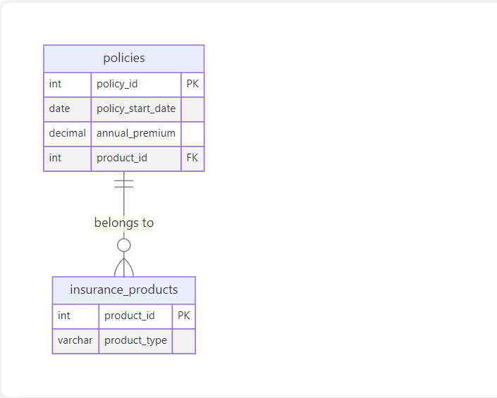
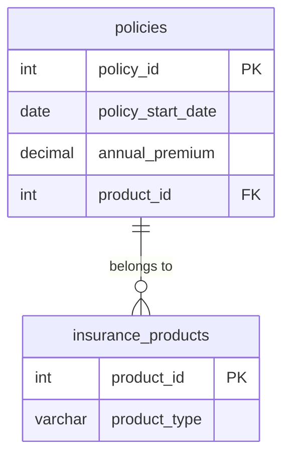

# 年間保険料収入統計報告書クエリ 002 (复杂的统计和聚合查询)

```sql
-- 年度保费收入统计报表
SELECT
    YEAR(p.policy_start_date) AS policy_year,
    ip.product_type,
    COUNT(p.policy_id) AS policy_count,
    SUM(p.annual_premium) AS total_premium,
    AVG(p.annual_premium) AS avg_premium,
    SUM(CASE WHEN QUARTER(p.policy_start_date) = 1 THEN p.annual_premium ELSE 0 END) AS q1_premium,
    SUM(CASE WHEN QUARTER(p.policy_start_date) = 2 THEN p.annual_premium ELSE 0 END) AS q2_premium,
    SUM(CASE WHEN QUARTER(p.policy_start_date) = 3 THEN p.annual_premium ELSE 0 END) AS q3_premium,
    SUM(CASE WHEN QUARTER(p.policy_start_date) = 4 THEN p.annual_premium ELSE 0 END) AS q4_premium
FROM policies p
INNER JOIN insurance_products ip ON p.product_id = ip.product_id
WHERE p.policy_start_date >= DATE_SUB(CURDATE(), INTERVAL 5 YEAR)
GROUP BY YEAR(p.policy_start_date), ip.product_type
ORDER BY policy_year DESC;
```



はい、こちらの SQL 文の意味を丁寧に説明しますね。
これは **保険契約のデータ（policies テーブル）** と **保険商品の情報（insurance_products テーブル）** を使って、過去 5 年間の契約を「年単位」「商品タイプ別」に集計するクエリです。

---

### 各部分の意味

#### 1. SELECT 句

```sql
YEAR(p.policy_start_date) AS policy_year
```

- 契約開始日 (`policy_start_date`) の「年」を取り出して `policy_year` という列名で表示。

```sql
ip.product_type
```

- 保険商品の種類（例: 自動車保険、医療保険など）。

```sql
COUNT(p.policy_id) AS policy_count
```

- 契約件数（その年・その商品タイプごと）。

```sql
SUM(p.annual_premium) AS total_premium
```

- その年・その商品タイプの保険料合計。

```sql
AVG(p.annual_premium) AS avg_premium
```

- 平均保険料（1 契約あたり）。

```sql
SUM(CASE WHEN QUARTER(p.policy_start_date) = 1 THEN p.annual_premium ELSE 0 END) AS q1_premium,
...
SUM(CASE WHEN QUARTER(p.policy_start_date) = 4 THEN p.annual_premium ELSE 0 END) AS q4_premium
```

- 四半期ごとの保険料合計。

  - Q1: 1〜3 月
  - Q2: 4〜6 月
  - Q3: 7〜9 月
  - Q4: 10〜12 月

#### 2. FROM & JOIN

```sql
FROM policies p
INNER JOIN insurance_products ip ON p.product_id = ip.product_id
```

- `policies`（契約情報）と `insurance_products`（商品マスタ）を結合して、契約に対応する商品の種類を取得。

#### 3. WHERE 句

```sql
WHERE p.policy_start_date >= DATE_SUB(CURDATE(), INTERVAL 5 YEAR)
```

- 今日から遡って 5 年間のデータに限定。

#### 4. GROUP BY

```sql
GROUP BY YEAR(p.policy_start_date), ip.product_type
```

- 集計の単位は「契約年 × 商品タイプ」。

#### 5. ORDER BY

```sql
ORDER BY policy_year DESC;
```

- 年の降順で表示（最新年が先）。

---

### 出力イメージ

例えば結果はこんな表になるイメージです：

| policy_year | product_type | policy_count | total_premium | avg_premium | q1_premium | q2_premium | q3_premium | q4_premium |
| ----------- | ------------ | ------------ | ------------- | ----------- | ---------- | ---------- | ---------- | ---------- |
| 2025        | 自動車保険   | 120          | 60,000,000    | 500,000     | 15,000,000 | 12,000,000 | 18,000,000 | 15,000,000 |
| 2025        | 医療保険     | 200          | 80,000,000    | 400,000     | 20,000,000 | 22,000,000 | 18,000,000 | 20,000,000 |
| 2024        | ...          | ...          | ...           | ...         | ...        | ...        | ...        | ...        |

---

👉 つまりこの SQL は
**「過去 5 年間の保険契約を、年ごと・商品タイプごとに、件数・合計保険料・平均保険料・四半期ごとの保険料まで集計して一覧化する」** クエリです。

---

ご希望なら、これを **ER 図風の図解**（policies と insurance_products の関係）や **処理フロー図** にして、より直感的に理解できるように作成しましょうか？

では、この SQL 文を **図解 + わかりやすい説明** に整理しますね。

---

## 🎯 SQL の目的

この SQL は「**過去 5 年間の保険契約データを、年度 × 商品タイプごとに集計して、件数や保険料の合計・平均・四半期別内訳を確認する**」ためのレポートを作るものです。

---

## 📊 集計内容

- **policy_year**
  保険契約開始日（`policy_start_date`）から「契約年度」を抽出
- **product_type**
  保険商品の種類（例: 自動車保険、生命保険、医療保険）
- **policy_count**
  契約件数
- **total_premium**
  契約年度ごとの総保険料
- **avg_premium**
  契約年度ごとの平均保険料
- **q1 ～ q4_premium**
  契約年度内の四半期ごとの保険料合計

---

## 🏗 テーブル関係図（ER 風）



- `policies`（契約テーブル）
  契約開始日・保険料・商品 ID などを持つ
- `insurance_products`（商品マスタ）
  商品 ID・商品種別を持つ
- `policies.product_id` → `insurance_products.product_id` により紐づく

---

## 📈 処理の流れ

1. **過去 5 年の契約データを抽出**

   ```sql
   WHERE p.policy_start_date >= DATE_SUB(CURDATE(), INTERVAL 5 YEAR)
   ```

   → 今日から 5 年前以降の契約だけ対象

2. **契約テーブルと商品マスタを結合**

   ```sql
   INNER JOIN insurance_products ip
   ON p.product_id = ip.product_id
   ```

   → 契約ごとに「どのタイプの商品か」を紐づける

3. **年度 × 商品タイプでグループ化**

   ```sql
   GROUP BY YEAR(p.policy_start_date), ip.product_type
   ```

   → 例：2023 年 × 自動車保険、2023 年 × 医療保険

4. **集計**

   - COUNT：件数
   - SUM：合計保険料
   - AVG：平均保険料
   - CASE + SUM：四半期ごとの保険料

5. **降順で並び替え**

   ```sql
   ORDER BY policy_year DESC
   ```

   → 新しい年度が先に表示される

---

## ✅ 出力イメージ（例）

| policy_year | product_type | policy_count | total_premium | avg_premium | q1_premium | q2_premium | q3_premium  | q4_premium |
| ----------- | ------------ | ------------ | ------------- | ----------- | ---------- | ---------- | ----------- | ---------- |
| 2025        | 自動車保険   | 1200         | 360,000,000   | 300,000     | 90,000,000 | 80,000,000 | 100,000,000 | 90,000,000 |
| 2025        | 医療保険     | 800          | 240,000,000   | 300,000     | 60,000,000 | 50,000,000 | 70,000,000  | 60,000,000 |
| 2024        | 自動車保険   | 1100         | 330,000,000   | 300,000     | ...        | ...        | ...         | ...        |

---

👉 つまりこの SQL は「**年度別 × 保険商品別の契約状況を分析する四半期レポート**」を生成しているわけです。

---

ご希望なら、この結果を **棒グラフや折れ線グラフ** で「年度ごとの商品タイプ別保険料推移」を可視化する図解も作成できますが、やりますか？

以下是转换为 Markdown 格式的内容：

````markdown
# SQL 表达式解析：按季度统计保费

这个 SQL 表达式是按季度统计保费的条件聚合函数，用于计算第一季度生效保单的年保费总和。以下是详细拆解：

## 一、语法拆解：条件求和的典型用法

```sql
SUM(
  CASE
    WHEN QUARTER(p.policy_start_date) = 1  -- 条件：保单生效日期在第一季度
    THEN p.annual_premium                  -- 满足条件时：取该保单的年保费
    ELSE 0                                 -- 不满足条件时：取0
  END
) AS q1_premium  -- 结果命名为“q1_premium”（第一季度保费）
```
````

## 二、关键函数解析

### `QUARTER(date)`

- **作用**：提取日期中的季度（1-4），例如：
  - `QUARTER('2023-02-15') = 1`（2 月属于第一季度）
  - `QUARTER('2023-04-01') = 2`（4 月属于第二季度）

### `CASE WHEN ... THEN ... ELSE ... END`

- **作用**：根据条件返回不同值，类似“if-else”逻辑：
  - 当保单生效在 Q1（1-3 月），计入该保单的 `annual_premium`（年保费）
  - 其他季度的保单，按“0”处理（不贡献 Q1 保费）

### `SUM(...)`

- **作用**：对所有保单的条件结果求和，得到 Q1 的总保费。

## 三、业务意义：季度保费统计

假设存在以下保单数据：

```sql

| policy_id | policy_start_date | annual_premium |
| --------- | ----------------- | -------------- | -------------- |
| 1001      | 2023-01-10        | 6000 元        | （Q1）         |
| 1002      | 2023-03-20        | 3600 元        | （Q1）         |
| 1003      | 2023-04-05        | 12000 元       | （Q2，不计入） |
```

**计算过程**：

- 保单 1001：`CASE` 返回 `6000` → 计入 Q1 总和
- 保单 1002：`CASE` 返回 `3600` → 计入 Q1 总和
- 保单 1003：`CASE` 返回 `0` → 不计入

**最终结果**：`q1_premium = 6000 + 3600 + 0 = 9600元`

## 四、扩展应用：多季度统计

通过复制该表达式，可一次性统计全年 4 个季度的保费：

```sql
SUM(CASE WHEN QUARTER(p.policy_start_date)=1 THEN p.annual_premium ELSE 0 END) AS q1_premium,
SUM(CASE WHEN QUARTER(p.policy_start_date)=2 THEN p.annual_premium ELSE 0 END) AS q2_premium,
SUM(CASE WHEN QUARTER(p.policy_start_date)=3 THEN p.annual_premium ELSE 0 END) AS q3_premium,
SUM(CASE WHEN QUARTER(p.policy_start_date)=4 THEN p.annual_premium ELSE 0 END) AS q4_premium
```

这种写法高效且易读，是业务分析中“按时间维度聚合”的常用技巧。

````

### 说明
1. 使用 `#` 和 `##` 表示标题和子标题。
2. 使用 ```sql ``` 包裹 SQL 代码块，确保语法高亮。
3. 使用表格语法展示示例数据。
4. 使用列表和段落清晰表达内容。
````

````markdown
# SQL 近 5 年保险产品年度保费统计报表解析

这份 SQL 是近 5 年保险产品年度保费统计报表，用于按"年份+产品类型"维度分析保费收入趋势。以下是完整逻辑解析：

## 一、核心功能：近 5 年保费多维度统计

### 1. 数据范围（WHERE 子句）

```sql
WHERE p.policy_start_date >= DATE_SUB(CURDATE(), INTERVAL 5 YEAR)
```
````

**作用**：仅统计最近 5 年生效的保单（如当前是 2025 年，则统计 2021-2025 年的数据）。  
**函数说明**：`DATE_SUB(CURDATE(), INTERVAL 5 YEAR)` 计算当前日期的 5 年前日期。

### 2. 分组维度（GROUP BY）

```sql
GROUP BY YEAR(p.policy_start_date), ip.product_type
```

**双维度分组**：

- 按"年份"和"产品类型"（如重疾险、医疗险）分组
- 每个组代表"某年度某产品类型"的汇总数据

### 3. 统计指标（SELECT 子句）

| 指标                    | 含义                                 | 业务价值         |
| ----------------------- | ------------------------------------ | ---------------- |
| `policy_year`           | 保单生效年份                         | 时间维度分析     |
| `product_type`          | 保险产品类型                         | 产品维度分析     |
| `policy_count`          | 保单数量（当年该产品类型的保单总数） | 销售规模指标     |
| `total_premium`         | 总保费（当年该产品类型的保费总和）   | 收入规模指标     |
| `avg_premium`           | 平均保费（总保费/保单数量）          | 产品单价分析     |
| `q1_premium~q4_premium` | 分季度保费（当年各季度的保费总和）   | 季度销售节奏分析 |

## 二、执行逻辑：从数据过滤到分组聚合

1. 筛选近 5 年保单 →
2. 关联产品表获取产品类型 →
3. 按"年份+产品类型"分组 →
4. 组内计算统计指标

**举例**：2023 年重疾险的数据会单独形成一个组，计算该组内的保单数量、总保费、各季度保费等。

## 三、典型结果样例（模拟数据）

| policy_year | product_type | policy_count | total_premium | avg_premium | q1_premium | q2_premium | q3_premium | q4_premium |
| ----------- | ------------ | ------------ | ------------- | ----------- | ---------- | ---------- | ---------- | ---------- |
| 2025        | 重疾险       | 120          | 720000 元     | 6000 元     | 180000 元  | 150000 元  | 210000 元  | 180000 元  |
| 2025        | 医疗险       | 350          | 420000 元     | 1200 元     | 90000 元   | 105000 元  | 120000 元  | 105000 元  |
| 2024        | 重疾险       | 105          | 630000 元     | 6000 元     | 150000 元  | 165000 元  | 135000 元  | 180000 元  |

## 四、业务价值

- **趋势分析**：对比不同年份同一产品的保费变化（如重疾险 2024 vs 2025 的增长情况）
- **季度规律**：识别产品销售的季度高峰（如 q3_premium 普遍较高，可能对应销售旺季）
- **产品结构**：分析不同产品类型的贡献占比（如重疾险总保费占比 60%）
- **目标制定**：基于历史数据制定下一年度的销售目标和季度分解计划

## 五、潜在优化建议

1. **添加索引**：在`p.policy_start_date`和`p.product_id`字段创建索引，提升大表查询效率
2. **处理 NULL 值**：若`product_type`可能为 NULL，建议通过`COALESCE(ip.product_type, '其他')`统一归类
3. **限制返回年份**：若只需查看近 3 年数据，可将`INTERVAL 5 YEAR`改为`INTERVAL 3 YEAR`

整体而言，这份 SQL 逻辑完整、指标清晰，可直接用于生成业务决策所需的保费统计报表。
