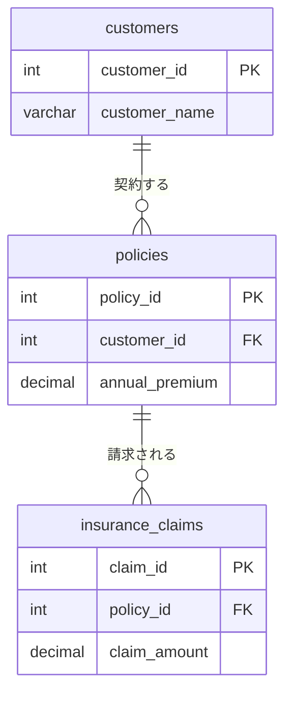
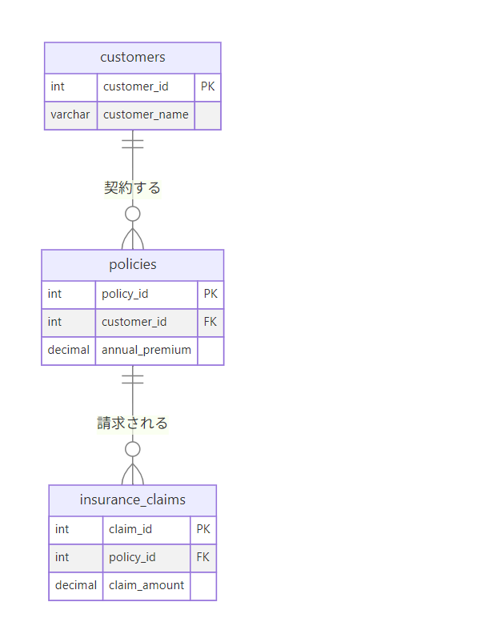
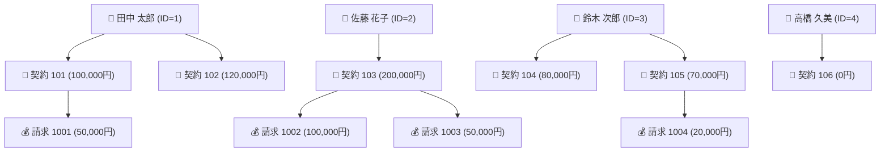
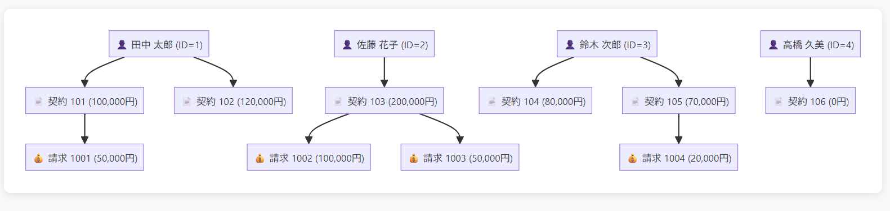

# 顧客価値分析クエリ 003 (子查询和条件计算)

```sql
-- 客户价值分析查询
SELECT
    c.customer_id,
    c.customer_name,
    COUNT(p.policy_id) AS total_policies,
    SUM(p.annual_premium) AS total_annual_premium,
    -- 客户生命周期价值估算
    SUM(p.annual_premium * 5) AS customer_ltv,
    -- 给付记录统计
    (SELECT COUNT(*) FROM insurance_claims ic
     INNER JOIN policies ip2 ON ic.policy_id = ip2.policy_id
     WHERE ip2.customer_id = c.customer_id) AS total_claims
FROM customers c
LEFT JOIN policies p ON c.customer_id = p.customer_id
GROUP BY c.customer_id, c.customer_name
HAVING total_policies > 0
ORDER BY total_annual_premium DESC;
```

いい質問ですね 👍
この SQL 文を分解して説明します。

---

### 1. **FROM 句 / JOIN 部分**

```sql
FROM customers c
LEFT JOIN policies p ON c.customer_id = p.customer_id
```

- `customers` テーブル（顧客情報）を基点にして、
- `policies` テーブル（契約/保険情報）を **顧客 ID で結合**しています。
- LEFT JOIN なので「顧客情報は残しつつ、契約がない場合は NULL になる」という形です。

---

### 2. **SELECT 句で取得している内容**

```sql
c.customer_id,
c.customer_name,
COUNT(p.policy_id) AS total_policies,
SUM(p.annual_premium) AS total_annual_premium,
SUM(p.annual_premium * 5) AS customer_ltv,
```

- `c.customer_id`, `c.customer_name`
  → 顧客の ID と名前。

- `COUNT(p.policy_id) AS total_policies`
  → その顧客が持つ **保険契約の数**。

- `SUM(p.annual_premium) AS total_annual_premium`
  → 顧客の契約している保険の **年間保険料の合計**。

- `SUM(p.annual_premium * 5) AS customer_ltv`
  → 年間保険料を「5 年分」と仮定した **顧客生涯価値 (LTV: Lifetime Value)**。
  ※ここではシンプルに「年間 ×5」で算出している。

---

### 3. **サブクエリ（SELECT の中の SELECT）**

```sql
(SELECT COUNT(*)
 FROM insurance_claims ic
 INNER JOIN policies ip2 ON ic.policy_id = ip2.policy_id
 WHERE ip2.customer_id = c.customer_id) AS total_claims
```

- `insurance_claims`（保険金請求テーブル）を参照して、
- `policies` と結合し、顧客ごとの **請求件数（total_claims）** を数えています。
- つまり「その顧客が過去に何回請求したか」を表します。

---

### 4. **GROUP BY / HAVING 句**

```sql
GROUP BY c.customer_id, c.customer_name
HAVING total_policies > 0
```

- 顧客単位で集計しています。
- ただし **契約数が 1 件以上ある顧客だけ** を対象にする。
  （契約ゼロの顧客は除外される）

---

### 5. **ORDER BY 句**

```sql
ORDER BY total_annual_premium DESC
```

- 年間保険料の合計額が多い顧客順に並べ替える。

---

## ✅ この SQL の意味（まとめ）

「顧客ごとに」

- 保険契約数
- 年間保険料合計
- 年間保険料を 5 年分とみなした LTV
- 過去の保険金請求件数

を集計し、**契約がある顧客のみ**を対象として、**年間保険料の高い順に一覧化する**。

---

👉 簡単に言うと、
**『契約を持っている顧客を対象に、売上価値（LTV）とリスク指標（請求回数）を可視化したランキング表』**
を作る SQL です。

---

もしご希望なら、この結果のサンプル出力（例のデータで表形式にしたもの）を作りましょうか？
了解しました！
では、今回の SQL に登場するテーブルの定義（シンプル化した想定スキーマ）と、それに基づくサンプルデータ、さらに SQL を実行した場合の模擬結果をお見せします。

---

## 1. テーブル定義（簡易版）

```sql
-- 顧客テーブル
CREATE TABLE customers (
    customer_id INT PRIMARY KEY,
    customer_name VARCHAR(100)
);

-- 保険契約テーブル
CREATE TABLE policies (
    policy_id INT PRIMARY KEY,
    customer_id INT,
    annual_premium DECIMAL(10,2),
    FOREIGN KEY (customer_id) REFERENCES customers(customer_id)
);

-- 保険金請求テーブル
CREATE TABLE insurance_claims (
    claim_id INT PRIMARY KEY,
    policy_id INT,
    claim_amount DECIMAL(10,2),
    FOREIGN KEY (policy_id) REFERENCES policies(policy_id)
);
```

---

## 2. サンプルデータ

```sql
-- 顧客
INSERT INTO customers VALUES
(1, '田中 太郎'),
(2, '佐藤 花子'),
(3, '鈴木 次郎'),
(4, '高橋 久美');

-- 保険契約
INSERT INTO policies VALUES
(101, 1, 100000),   -- 田中
(102, 1, 120000),
(103, 2, 200000),   -- 佐藤
(104, 3, 80000),    -- 鈴木
(105, 3, 70000),
(106, 4, 0);        -- 高橋 (無効契約例として0円)

-- 保険金請求
INSERT INTO insurance_claims VALUES
(1001, 101, 50000), -- 田中
(1002, 103, 100000),-- 佐藤
(1003, 103, 50000), -- 佐藤
(1004, 105, 20000); -- 鈴木
```

---

## 3. SQL の実行結果（模擬）

SQL を流したらこんな感じの結果が出ます 👇

| customer_id | customer_name | total_policies | total_annual_premium | customer_ltv | total_claims |
| ----------- | ------------- | -------------- | -------------------- | ------------ | ------------ |
| 2           | 佐藤 花子     | 1              | 200000               | 1000000      | 2            |
| 1           | 田中 太郎     | 2              | 220000               | 1100000      | 1            |
| 3           | 鈴木 次郎     | 2              | 150000               | 750000       | 1            |
| 4           | 高橋 久美     | 1              | 0                    | 0            | 0            |

---

## 4. 読み方

- **田中 太郎**：契約 2 件、年間保険料 220,000 円、LTV = 1,100,000 円、請求 1 回
- **佐藤 花子**：契約 1 件、年間保険料 200,000 円、LTV = 1,000,000 円、請求 2 回
- **鈴木 次郎**：契約 2 件、年間保険料 150,000 円、LTV = 750,000 円、請求 1 回
- **高橋 久美**：契約はあるが年額 0 円なので実質無効。請求なし

※SQL の `HAVING total_policies > 0` により、契約ゼロの顧客は結果に出ません。

---

👉 このサンプルをもとに「LTV の高い顧客ランキング」や「請求リスクの多い顧客」を分析できます。

ご希望なら、これを **ER 図（Mermaid 形式）** にしてお見せしましょうか？
了解しました 👍
では、先ほどの 3 テーブル（customers / policies / insurance_claims）を ER 図 にしてみます。
Mermaid の記法で描くとこうなります 👇



## 

### 説明

- **customers**（顧客）と **policies**（契約）は 1 対多
  → 1 人の顧客が複数の契約を持てる
- **policies**（契約）と **insurance_claims**（請求）も 1 対多
  → 1 つの契約に複数の請求が紐づく

これで「顧客 → 契約 → 請求」という流れが視覚的に分かるようになっています。

---

👉 ご要望次第で、前の「模擬データ」をこの ER 図に対応した **リレーション付き表形式** で可視化（顧客ごとに契約と請求がどう繋がっているか）することもできますが、やってみますか？
了解しました 👍
では、先ほどの **模擬データ** を「顧客 → 契約 → 請求」というリレーション付きで表形式に可視化します。

---

## 1. 顧客と契約・請求の対応関係

| 顧客 ID | 顧客名    | 契約 ID | 年間保険料 | 請求 ID | 請求金額 |
| ------- | --------- | ------- | ---------- | ------- | -------- |
| 1       | 田中 太郎 | 101     | 100,000    | 1001    | 50,000   |
| 1       | 田中 太郎 | 102     | 120,000    | NULL    | NULL     |
| 2       | 佐藤 花子 | 103     | 200,000    | 1002    | 100,000  |
| 2       | 佐藤 花子 | 103     | 200,000    | 1003    | 50,000   |
| 3       | 鈴木 次郎 | 104     | 80,000     | NULL    | NULL     |
| 3       | 鈴木 次郎 | 105     | 70,000     | 1004    | 20,000   |
| 4       | 高橋 久美 | 106     | 0          | NULL    | NULL     |

---

## 2. 顧客単位のまとめ（わかりやすく整形）

- **田中 太郎 (ID=1)**

  - 契約

    - 101: 年間保険料 100,000 円 → 請求(1001, 50,000 円)
    - 102: 年間保険料 120,000 円 → 請求なし

  - 合計：契約 2 件、年間保険料 220,000 円、請求 1 件

- **佐藤 花子 (ID=2)**

  - 契約

    - 103: 年間保険料 200,000 円 → 請求(1002, 100,000 円), (1003, 50,000 円)

  - 合計：契約 1 件、年間保険料 200,000 円、請求 2 件

- **鈴木 次郎 (ID=3)**

  - 契約

    - 104: 年間保険料 80,000 円 → 請求なし
    - 105: 年間保険料 70,000 円 → 請求(1004, 20,000 円)

  - 合計：契約 2 件、年間保険料 150,000 円、請求 1 件

- **高橋 久美 (ID=4)**

  - 契約

    - 106: 年間保険料 0 円 → 請求なし

  - 合計：契約 1 件、年間保険料 0 円、請求 0 件

---

✅ これで **ER 図** だけでなく、データがどう繋がっているかまで「見える化」できました。

---

👉 ご希望であれば、これを **Mermaid の階層図（ツリー構造）** にして「顧客 → 契約 → 請求」を直感的に可視化することもできますが、やってみますか？
了解しました 👍
では、顧客 → 契約 → 請求 をツリー構造で表現した Mermaid のコードを作ります。

---

## Mermaid 階層図（ツリー構造）





## 説明

- 👤 顧客 → 📄 契約 → 💰 請求 の流れでツリー表示
- 金額もノードに併記して直感的に理解できるようにしています
- 請求がない契約は枝が出ません

---

👉 このツリーを使うと「どの顧客がどの契約を持っていて、請求がどれくらい発生しているか」が一目で分かります。

ご希望であれば、さらに **顧客ごとに LTV や請求件数をまとめたサマリーツリー**（数値付き）も作ってみましょうか？

````markdown
# 客户价值与风险分析 SQL 查询解析

## 一、查询目的

该 SQL 查询旨在通过多维度指标分析客户价值与风险，识别高价值客户，为保险公司精细化运营提供数据支持。

## 二、查询结构分析

### 1. 涉及表及关系

- **customers**: 客户表，存储客户基本信息
- **policies**: 保单表，存储保单信息，通过`customer_id`与客户表关联
- **insurance_claims**: 保险理赔表，通过`policy_id`与保单表关联

### 2. 连接方式

- **LEFT JOIN** `policies p` ON `c.customer_id = p.customer_id`: 左连接保单表，确保获取所有客户及其保单信息
- **子查询中 INNER JOIN** `insurance_claims ic` ON `ic.policy_id = ip2.policy_id`: 内连接理赔表，统计有理赔记录的保单

### 3. 过滤条件

- **HAVING** `total_policies > 0`: 仅保留有保单记录的活跃客户

### 4. 排序方式

- **ORDER BY** `total_annual_premium DESC`: 按总年保费降序排列，优先展示高价值客户

## 三、关键指标解析

### 1. 保单数量 (`total_policies`)

- **计算逻辑**: `COUNT(p.policy_id)`
- **业务含义**: 客户投保的保单总数，反映客户对保险产品的接受程度

### 2. 总年保费 (`total_annual_premium`)

- **计算逻辑**: `SUM(p.annual_premium)`
- **业务含义**: 客户每年贡献的总保费收入，直接反映客户当前价值

### 3. 客户生命周期价值 (`customer_ltv`)

- **计算逻辑**: `SUM(p.annual_premium * 5)`
- **业务含义**: 预估客户在 5 年生命周期内贡献的总价值，假设客户平均留存 5 年

### 4. 理赔次数 (`total_claims`)

- **计算逻辑**: 子查询统计客户的理赔次数
- **业务含义**: 反映客户的理赔频率，是评估客户风险的重要指标

## 四、业务应用场景

### 1. 客户价值分层

- **高价值客户**: 年保费高、LTV 高，可提供 VIP 服务
- **潜力客户**: 保单数量多但单均保费低，可推荐升级产品
- **普通客户**: 保单数量少、保费低，可通过交叉销售提升价值

### 2. 风险评估

- **低风险高价值客户**: 保费高且理赔少，是核心利润来源
- **高风险客户**: 保费低但理赔频繁，需进行风险管控

### 3. 精细化运营策略

- 针对不同价值和风险特征的客户制定差异化服务和营销策略
- 优化客户获取和留存策略，提高整体客户价值

## 五、查询优化建议

### 1. 理赔次数统计优化

原查询中理赔次数统计使用`INNER JOIN`，无理赔记录时会返回`NULL`，建议优化为：

```sql
(SELECT COALESCE(COUNT(*), 0)
 FROM insurance_claims ic
 LEFT JOIN policies ip2 ON ic.policy_id = ip2.policy_id
 WHERE ip2.customer_id = c.customer_id
) AS total_claims
```
````

### 2. LTV 计算逻辑透明化

建议添加注释说明"5 年"的假设来源，如行业平均留存年限或公司历史数据。

### 3. 索引优化

在以下字段添加索引可提高查询性能：

- `customers.customer_id`
- `policies.customer_id`
- `insurance_claims.policy_id`

## 六、总结

该查询通过"价值+风险"双维度构建客户画像，是保险公司客户分层运营、资源精准投放的核心分析工具。通过结果可直接定位高价值客户群体，同时识别风险客户，实现收益最大化与风险可控的平衡。

```

```
