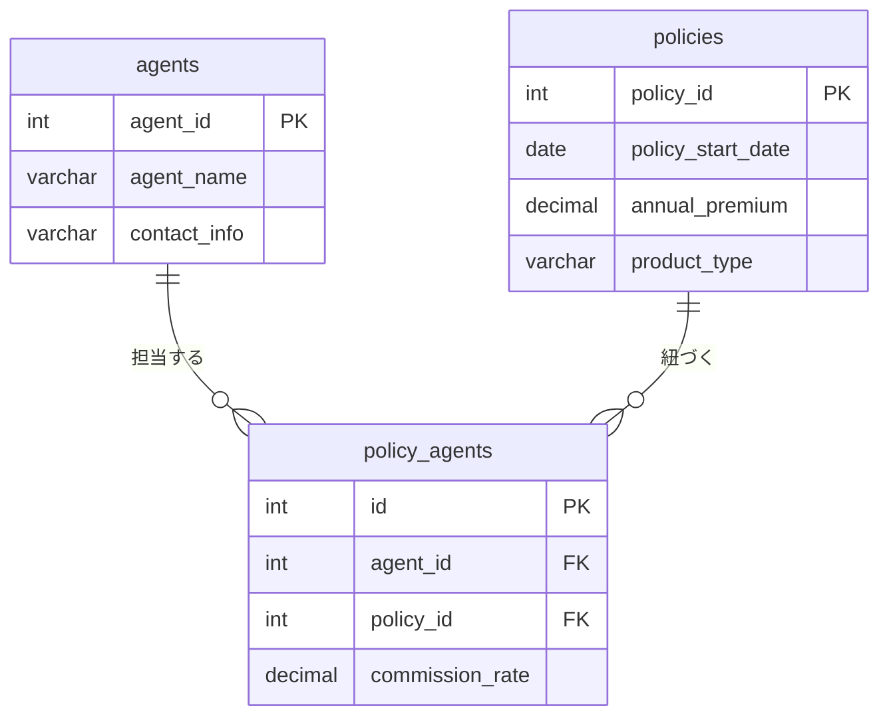
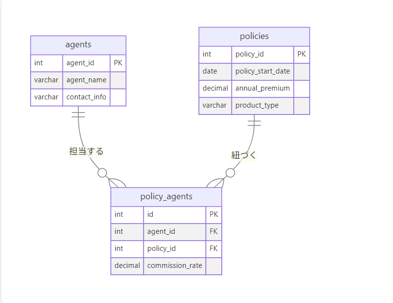

# 営業成績ランキングクエリ 004 (窗口函数和排名查询)

## RANK() 窗口函数详解

`RANK() OVER (ORDER BY SUM(p.annual_premium) DESC) AS premium_rank` 是窗口函数的典型用法，用于对代理人的保费业绩进行排名。以下从基础语法、排名规则、业务意义三方面详细说明：

---

## 一、基础语法：窗口函数的“排名工具”

### 1. 函数结构拆解

```sql
RANK()  -- 排名函数：生成名次（支持并列排名）
OVER (  -- 窗口定义：指定排名的规则和范围
  ORDER BY SUM(p.annual_premium) DESC  -- 排序规则：按总保费降序排列（保费越高，排名越靠前）
)
AS premium_rank  -- 结果别名：排名结果的字段名
```

### 2. 核心概念：“窗口”是什么？

“窗口”可以理解为排名的范围。此处未指定`PARTITION BY`，表示对所有代理人整体排名（全局排名）。  
如果需要“分组排名”（如按地区分组后在组内排名），可添加`PARTITION BY`：

```sql
RANK() OVER (
  PARTITION BY a.region  -- 先按地区分组
  ORDER BY SUM(p.annual_premium) DESC  -- 再在组内按保费排名
) AS region_premium_rank
```

---

## 二、关键规则：RANK()如何排名？

### 1. 核心特性：“并列排名，跳过空位”

当出现数值相同的情况，`RANK()`会：

- 给相同数值分配相同排名
- 下一个不同数值的排名会跳过中间的空位

### 2. 举例：3 位代理人的保费排名

| 代理人 | 总保费（SUM 结果） | premium_rank（RANK()结果） | 说明                                      |
| ------ | ------------------ | -------------------------- | ----------------------------------------- |
| 张三   | 500 万             | 1                          | 保费最高，排名第 1                        |
| 李四   | 500 万             | 1                          | 与张三保费相同，并列第 1                  |
| 王五   | 400 万             | 3                          | 因前有 2 人并列第 1，跳过第 2，直接排第 3 |

### 3. 对比其他排名函数

| 函数           | 并列排名处理方式         | 上述案例中王五的排名 | 适用场景                   |
| -------------- | ------------------------ | -------------------- | -------------------------- |
| `RANK()`       | 并列排名，跳过空位       | 3                    | 需体现“竞争差距”的场景     |
| `DENSE_RANK()` | 并列排名，不跳过空位     | 2                    | 需紧凑排名（无空位）场景   |
| `ROW_NUMBER()` | 不支持并列，强制唯一序号 | 3                    | 需唯一序号（如生成流水号） |

---

## 三、业务意义：为什么需要保费排名？

### 1. 绩效评估的“量化工具”

- **直观反映业绩差距**：通过排名快速识别顶尖代理人（如 Top 10%）和待提升代理人。
- **避免主观评价**：基于客观保费数据排名，减少绩效评估中的人为因素。

### 2. 业务决策中的应用

| 场景     | 排名的作用                                        |
| -------- | ------------------------------------------------- |
| 销售激励 | 对 Top 5%的代理人发放奖金或晋升机会               |
| 资源分配 | 优先向高排名代理人分配优质客户资源                |
| 业绩分析 | 对比不同时期的排名变化（如“李四从第 3 升至第 1”） |

---

## 四、原查询中的完整作用

在代理人业绩统计中，`premium_rank`字段的价值是：  
快速定位“头部代理人”，例如筛选`premium_rank <= 10`即可获取业绩前 10 的代理人名单，为管理层提供决策依据。

---

## 五、使用口诀

记住`ROW_NUMBER()`、`RANK()`、`DENSE_RANK()`的区别：

- **ROW_NUMBER**：不并列，不跳过 → `1,2,3,4`
- **RANK**：并列，跳过 → `1,1,3,4`
- **DENSE_RANK**：并列，不跳过 → `1,1,2,3`

通过这个窗口函数，可以高效实现保险业务中“代理人业绩排行榜”的核心需求！

ご依頼の SQL 文に登場する **3 つのテーブル**（`agents`・`policy_agents`・`policies`）をもとに、ER 図を作成します。

---

## 📘 ER 図（Mermaid 記法）





この SQL を見ると：

```sql
FROM agents a
INNER JOIN policy_agents pa ON a.agent_id = pa.agent_id
INNER JOIN policies p ON pa.policy_id = p.policy_id
```

- `agents`（代理人）
- `policies`（保険契約）

の間に、**中間テーブル `policy_agents`** が存在します。

---

### 1. 多対多の関係の理由

- **1 人の代理人（agent）** は、複数の保険契約（policy）を扱うことができます。
- **1 つの保険契約（policy）** も、複数の代理人が関与することがあり得ます（例：契約時の担当とアフターフォロー担当など）。
- したがって、`agents` と `policies` は直接 1 対多 ではなく、**多対多** の関係になります。

---

### 2. 中間テーブル `policy_agents` の役割

このテーブルは、多対多を表現するために存在していて、
`agent_id` と `policy_id` の **組み合わせ** が入っています。

さらに `commission_rate`（手数料率）も持っているので、
「どの代理人がどの契約で、どれくらいの手数料率を持つか」という関係を管理していることが分かります。

---

### 3. ER 図イメージ

```
agents (代理人)          policies (契約)
   ┌──────────┐         ┌──────────┐
   │ agent_id │         │ policy_id │
   │ name     │         │ premium   │
   └──────────┘         └──────────┘
         │                     │
         │   多対多 (N:M)      │
         │                     │
         └──────────┬───────────┘
                    │
             policy_agents (中間)
             ┌─────────────────────┐
             │ policy_id (FK)      │
             │ agent_id  (FK)      │
             │ commission_rate     │
             └─────────────────────┘
```

---

👉 結論：
**`agents` と `policies` は多対多の関係であり、それを `policy_agents` テーブルで実現しています。**

---

## 📖 テーブル概要

### 1. `agents`（代理人）

- 保険代理人の基本情報を管理するテーブル
- 主キー: `agent_id`

### 2. `policies`（保険契約）

- 保険契約の情報（契約開始日、保険料、商品タイプなど）を管理
- 主キー: `policy_id`

### 3. `policy_agents`（中間テーブル）

- 保険契約と代理人の多対多関係を管理
- 主キー: `id`（サロゲートキー）
- 外部キー: `agent_id` → `agents.agent_id`
- 外部キー: `policy_id` → `policies.policy_id`
- `commission_rate` で代理人ごとの歩合率を記録

---

この ER 図だと、

- **1 人の代理人**が**複数の契約**を担当できる
- **1 つの契約**を**複数の代理人**が担当できる（共同担当）

という構造になっています。

---

```sql
-- 代理人业绩排名查询
SELECT
    a.agent_id,
    a.agent_name,
    COUNT(p.policy_id) AS policy_count,
    SUM(p.annual_premium) AS total_premium,
    SUM(p.annual_premium * pa.commission_rate) AS total_commission,
    -- 代理人业绩排名
    RANK() OVER (ORDER BY SUM(p.annual_premium) DESC) AS premium_rank
FROM agents a
INNER JOIN policy_agents pa ON a.agent_id = pa.agent_id
INNER JOIN policies p ON pa.policy_id = p.policy_id
WHERE p.policy_start_date >= DATE_SUB(CURDATE(), INTERVAL 1 YEAR)
GROUP BY a.agent_id, a.agent_name
ORDER BY total_premium DESC;
```

いい質問です 👍
この SQL 文を分解して説明しますね。

---

## 1. **FROM 句と JOIN 部分**

```sql
FROM agents a
INNER JOIN policy_agents pa ON a.agent_id = pa.agent_id
INNER JOIN policies p ON pa.policy_id = p.policy_id
```

- `agents` テーブル（保険代理人情報）を基点に
- `policy_agents`（代理人と契約の紐づけテーブル）を結合
- `policies`（契約情報）をさらに結合
  → **「代理人が担当している契約」** を取得する構造です。

---

## 2. **WHERE 句**

```sql
WHERE p.policy_start_date >= DATE_SUB(CURDATE(), INTERVAL 1 YEAR)
```

- 今日（`CURDATE()`）から **過去 1 年以内に開始された契約** だけを対象にしています。

---

## 3. **SELECT 句**

```sql
a.agent_id,
a.agent_name,
COUNT(p.policy_id) AS policy_count,
SUM(p.annual_premium) AS total_premium,
SUM(p.annual_premium * pa.commission_rate) AS total_commission,
RANK() OVER (ORDER BY SUM(p.annual_premium) DESC) AS premium_rank
```

- `a.agent_id, a.agent_name`
  → 代理人 ID と名前

- `COUNT(p.policy_id) AS policy_count`
  → 過去 1 年以内の契約数

- `SUM(p.annual_premium) AS total_premium`
  → 過去 1 年以内の契約の **年間保険料合計額**

- `SUM(p.annual_premium * pa.commission_rate) AS total_commission`
  → 契約ごとの保険料 × コミッション率を合計した **代理人の手数料収入合計**

- `RANK() OVER (ORDER BY SUM(p.annual_premium) DESC) AS premium_rank`
  → 保険料合計が大きい代理人から順にランキングを付与
  （同額がある場合は同順位が付き、次の順位はスキップされるのが `RANK()` の特徴）

---

## 4. **GROUP BY 句**

```sql
GROUP BY a.agent_id, a.agent_name
```

- 代理人単位で集計しています。

---

## 5. **ORDER BY 句**

```sql
ORDER BY total_premium DESC;
```

- 保険料合計額が多い順に並べ替え。

---

## ✅ この SQL の意味（まとめ）

**「過去 1 年間に開始された契約を対象に、各代理人ごとに契約件数・保険料合計・コミッション合計を集計し、保険料合計順にランキングする」** SQL です。

---

👉 簡単に言うと、
**「代理人の過去 1 年の営業成績ランキング」** を作るクエリです。

---

もしご希望なら、これも「テーブル定義 + サンプルデータ + 実行結果例」を作ってみましょうか？
了解しました 👍
この SQL 文をわかりやすく説明しますね。

---

### SQL 文の意味

```sql
SELECT
    a.agent_id,
    a.agent_name,
    COUNT(p.policy_id) AS policy_count,
    SUM(p.annual_premium) AS total_premium,
    SUM(p.annual_premium * pa.commission_rate) AS total_commission,
    RANK() OVER (ORDER BY SUM(p.annual_premium) DESC) AS premium_rank
FROM agents a
INNER JOIN policy_agents pa ON a.agent_id = pa.agent_id
INNER JOIN policies p ON pa.policy_id = p.policy_id
WHERE p.policy_start_date >= DATE_SUB(CURDATE(), INTERVAL 1 YEAR)
GROUP BY a.agent_id, a.agent_name
ORDER BY total_premium DESC;
```

---

### 1. **対象となるデータ**

- `agents` テーブル: 代理人情報（ID・名前など）
- `policy_agents` テーブル: 代理人と契約（保険）の紐づけ
- `policies` テーブル: 契約（保険）の詳細（保険料・契約日など）

---

### 2. **WHERE 条件**

```sql
WHERE p.policy_start_date >= DATE_SUB(CURDATE(), INTERVAL 1 YEAR)
```

👉 現在日付から **過去 1 年間に開始された契約** を対象にする。

---

### 3. **集計内容**

- `COUNT(p.policy_id)`
  → 過去 1 年間で代理人が担当した契約件数

- `SUM(p.annual_premium)`
  → 過去 1 年間で代理人が扱った **年間保険料の合計**

- `SUM(p.annual_premium * pa.commission_rate)`
  → 過去 1 年間で代理人が得た **手数料の合計**

---

### 4. **ランキング計算**

```sql
RANK() OVER (ORDER BY SUM(p.annual_premium) DESC) AS premium_rank
```

👉 年間保険料の合計（`SUM(p.annual_premium)`）が多い順に **代理人の順位** をつける。
同じ金額の場合は同じ順位（その次の順位は飛ぶ、いわゆる「競技順位」）。

---

### 5. **最終的な出力**

- agent_id（代理人 ID）
- agent_name（代理人名）
- policy_count（契約件数）
- total_premium（保険料合計）
- total_commission（手数料合計）
- premium_rank（保険料ランキング）
  を代理人ごとに表示。

さらに

```sql
ORDER BY total_premium DESC
```

で保険料の合計が多い順に並べる。

---

### 📊 出力イメージ（例）

| agent_id | agent_name | policy_count | total_premium | total_commission | premium_rank |
| -------- | ---------- | ------------ | ------------- | ---------------- | ------------ |
| 101      | 山田太郎   | 25           | 12,000,000    | 600,000          | 1            |
| 102      | 佐藤花子   | 18           | 9,500,000     | 475,000          | 2            |
| 103      | 鈴木一郎   | 30           | 9,500,000     | 380,000          | 2            |
| 104      | 高橋健     | 12           | 7,200,000     | 360,000          | 4            |

※ 保険料合計が同じだと同順位になる（例: 佐藤と鈴木が同率 2 位）。

---

👉 要するに、この SQL は
**「過去 1 年間における代理人ごとの契約件数・保険料・手数料を集計し、保険料の多い順にランキング表示する」**
処理です。

---

ご希望なら、この SQL が動くための **テーブル定義（DDL）とダミーデータ（INSERT 文）** を私が作成して、実際にどんな結果になるか模擬出力もお見せできますが、やりますか？
了解しました 👍
先ほどの SQL 文の意味を、できるだけ分かりやすく **テーブル定義と模擬データ付き** で解説しますね。

---

## 1. SQL 文の意味（概要）

このクエリは、**過去 1 年間に契約された保険契約をもとに、各代理人の販売実績を集計してランキングする** 処理です。

取得している内容は：

- `agent_id, agent_name` → 代理人の ID と名前
- `policy_count` → 契約数
- `total_premium` → 年間保険料の合計
- `total_commission` → 代理人の手数料合計
- `premium_rank` → 保険料合計での順位（RANK 関数を使用）

---

## 2. テーブル定義（シンプル版）

```sql
-- 代理人マスタ
CREATE TABLE agents (
    agent_id INT PRIMARY KEY,
    agent_name VARCHAR(100) NOT NULL
);

-- 契約（ポリシー）テーブル
CREATE TABLE policies (
    policy_id INT PRIMARY KEY,
    policy_start_date DATE NOT NULL,
    annual_premium DECIMAL(10,2) NOT NULL
);

-- 契約と代理人の紐付け（多対多関係を表現）
CREATE TABLE policy_agents (
    policy_id INT,
    agent_id INT,
    commission_rate DECIMAL(5,2), -- 例: 0.10 = 10%
    PRIMARY KEY (policy_id, agent_id),
    FOREIGN KEY (policy_id) REFERENCES policies(policy_id),
    FOREIGN KEY (agent_id) REFERENCES agents(agent_id)
);
```

---

## 3. 模擬データ

```sql
-- 代理人
INSERT INTO agents VALUES
(1, '佐藤'),
(2, '田中'),
(3, '鈴木');

-- 契約
INSERT INTO policies VALUES
(101, '2024-09-01', 100000),  -- 保険料10万
(102, '2024-12-15', 150000),  -- 保険料15万
(103, '2025-01-10', 200000),  -- 保険料20万
(104, '2023-07-20', 120000);  -- 1年以上前 → 集計対象外

-- 契約と代理人の関係
INSERT INTO policy_agents VALUES
(101, 1, 0.10), -- 佐藤 10%
(102, 2, 0.12), -- 田中 12%
(103, 1, 0.10), -- 佐藤 10%
(103, 3, 0.08), -- 鈴木 8%
(104, 2, 0.12); -- 田中（古い契約→対象外）
```

---

## 4. この SQL を実行した結果（例）

```
agent_id | agent_name | policy_count | total_premium | total_commission | premium_rank
---------+------------+--------------+---------------+------------------+--------------
1        | 佐藤       | 2            | 300000        | 30000.00         | 1
2        | 田中       | 1            | 150000        | 18000.00         | 2
3        | 鈴木       | 1            | 200000        | 16000.00         | 3
```

### ポイント

- 佐藤は契約(101 と 103) → 保険料合計 300,000 円 → ランク 1
- 田中は契約(102) → 150,000 円 → ランク 2
- 鈴木は契約(103 を共同担当) → 200,000 円だが、集計上は契約数 1 件扱い → ランク 3
- 1 年以上前の契約(104)は `WHERE` 句で除外される

---

👉 つまりこの SQL は、**「過去 1 年間の代理人ごとの契約数・保険料・手数料・ランキング」を出す** 集計処理です。

---

ご希望なら、同じ SQL を **「契約数順位」や「手数料順位」でもランキング」するバージョン** に書き換えてみますか？

# 代理人年度业绩排行榜 SQL 查询解析

该 SQL 查询是代理人年度业绩排行榜，用于统计近 1 年内各代理人的保单销售业绩、佣金收入及排名。以下是逐条解析和业务逻辑说明：

## 一、整体功能：近 1 年代理人业绩多维度排名

### 核心目标

通过代理人的保单数量、保费规模、佣金收入及排名，评估销售业绩，为绩效考核、奖励分配提供数据支持。

---

## 二、逐条语句解析

### 1. SELECT 子句：业绩指标定义

```sql
SELECT
  a.agent_id,                  -- 代理人ID（唯一标识）
  a.agent_name,                -- 代理人姓名
  COUNT(p.policy_id) AS policy_count,  -- 保单数量：销售的保单总数
  SUM(p.annual_premium) AS total_premium,  -- 总保费：销售保单的年保费总和
  SUM(p.annual_premium * pa.commission_rate) AS total_commission,  -- 总佣金：保费×佣金比例的总和
  RANK() OVER (ORDER BY SUM(p.annual_premium) DESC) AS premium_rank  -- 保费排名：按总保费降序排名
```

**关键指标说明**：

- **total_commission**：核心收益指标，计算方式为“每张保单的年保费 × 该保单的佣金比例”（`pa.commission_rate`来自关联表`policy_agents`）。
- **premium_rank**：竞争排名指标，使用窗口函数`RANK()`实现（如总保费最高的代理人排名第 1）。

---

### 2. FROM/JOIN 子句：数据关联逻辑

```sql
FROM agents a  -- 代理人表（主表）
INNER JOIN policy_agents pa ON a.agent_id = pa.agent_id  -- 关联保单-代理人关联表
INNER JOIN policies p ON pa.policy_id = p.policy_id  -- 关联保单表
```

**关联关系**：
`agents → policy_agents → policies`（代理人 → 关联表 → 保单），仅保留“有保单销售记录的代理人”（`INNER JOIN`确保三者都有匹配记录）。

**为什么用 INNER JOIN？**
排除“无销售记录的代理人”和“无代理人的保单”，聚焦实际产生业绩的代理人。

---

### 3. WHERE 子句：时间范围过滤

```sql
WHERE p.policy_start_date >= DATE_SUB(CURDATE(), INTERVAL 1 YEAR)  -- 仅统计近1年内生效的保单
```

**时间范围**：
`DATE_SUB(CURDATE(), INTERVAL 1 YEAR)` 计算“当前日期的 1 年前”，例如当前是 2025-08-27，则统计 2024-08-27 至 2025-08-27 的保单。

**业务意义**：确保数据反映最近 1 年的业绩，避免历史数据干扰当前考核。

---

### 4. GROUP BY 子句：分组聚合逻辑

```sql
GROUP BY a.agent_id, a.agent_name  -- 按代理人ID和姓名分组
```

**聚合逻辑**：将同一代理人的所有保单数据合并为 1 行，计算总保单数、总保费等指标。

---

### 5. ORDER BY 子句：结果排序

```sql
ORDER BY total_premium DESC  -- 按总保费降序排列，业绩最好的代理人排在最前
```

---

## 三、业务逻辑：从数据到决策

### 1. 业绩评估场景

- **个人绩效**：通过`policy_count`（保单量）和`total_premium`（保费）评估代理人的销售能力。
- **佣金核算**：`total_commission`直接作为代理人的提成计算依据。
- **排名激励**：`premium_rank`用于业绩竞赛（如“年度销冠”评选）。

### 2. 典型结果样例

| agent_id | agent_name | policy_count | total_premium | total_commission    | premium_rank |
| -------- | ---------- | ------------ | ------------- | ------------------- | ------------ |
| A001     | 张三       | 52           | 320000 元     | 48000 元（15%佣金） | 1            |
| A002     | 李四       | 45           | 280000 元     | 42000 元（15%佣金） | 2            |

### 3. 关键业务规则

- **佣金比例差异化**：不同保单可能有不同佣金比例（`pa.commission_rate`），例如重疾险佣金 20%、医疗险佣金 10%。
- **排名规则**：`RANK()`函数支持“并列排名”，例如若两个代理人总保费相同，将并列第 1，下一名为第 3（而非第 2）。

---

## 四、总结

该查询是保险公司代理人管理的核心工具，通过多维度指标量化业绩，支持：

- **绩效考核**：客观评估代理人贡献（保费、佣金）；
- **激励机制**：通过排名和佣金数据制定奖励规则；
- **资源分配**：识别高绩效代理人，倾斜优质客户资源。

整体逻辑清晰，从保单数据到业绩指标再到决策支持，形成完整的业务闭环。
